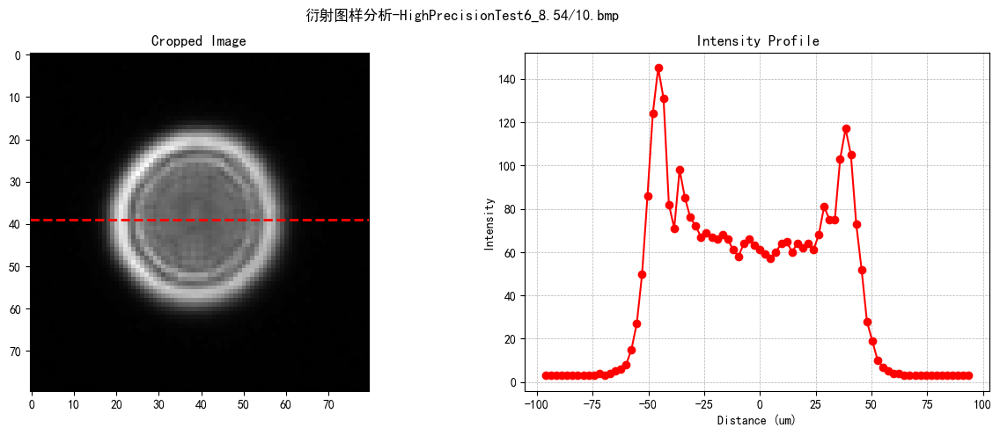
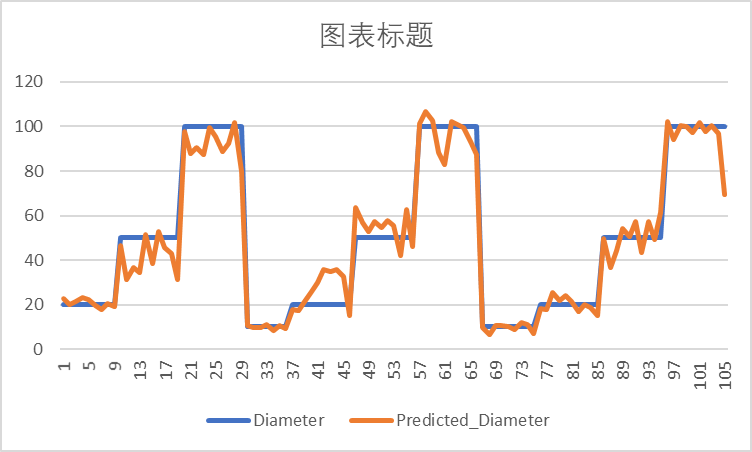
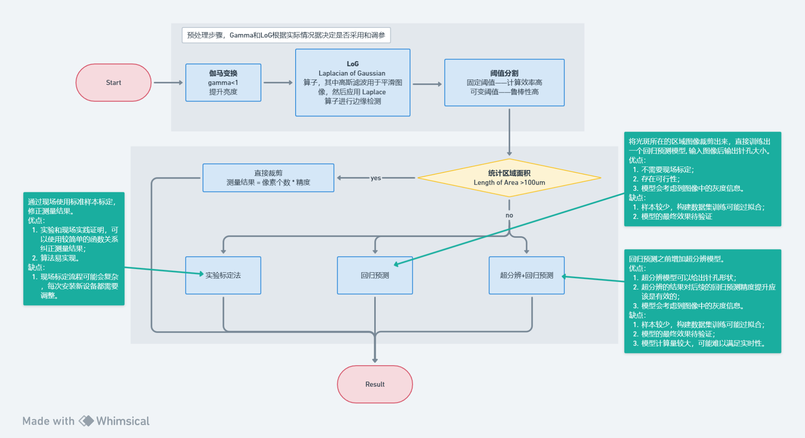

<!--
 * @Date: 2024-03-06 21:33:42
 * @LastEditors: wind-listener 2775174829@qq.com
 * @LastEditTime: 2024-03-08 16:55:29
 * @FilePath: \PinholeAnalysis\README.md
-->
<div align="center">
<h1>Copper Coil Pinehole Efficent Detection 😏</h1>
<h3> 高性能铜箔针孔缺陷的高效检测 研究与方法 </h3>

Authors: [Zhiming Zhang](https://github.com/wind-listener)
</div>

# Introduction


# Fuction
## Dataset Preparation and Analysis
最好在[这个ipynb](prepareDataset.ipynb)中修改
- 分割图片
- 统计特征信息

## 相关性分析
分析孔直径、成像距离和成像精度和成像放大倍率的关系
[plot_diameter_magnification.py](plot_diameter_magnification.py)
[plot_distance_magnification.py](plot_distance_magnification.py)
[plot_precision_magnification.py](plot_precision_magnification.py)

## Pinhole Simulation
基于proper库的光学仿真，研究衍射、艾里斑等现象
Install [Proper Package](https://sourceforge.net/projects/proper-library/files/) as following:
```

```



## Pinhole Prediction
### MLP
通过使用人工设计的特征，使用MLP进行回归预测

### CNN+MLP
目前结果很糟糕


## Deployment


# Acknowledgement
We would like to express our sincere gratitude to the following individuals and organizations for their invaluable contributions to this project:

- [BUPT AI College HMI Lab](https://ai.bupt.edu.cn/xygk/zzjg/syzx.htm) 
- [Techmach](https://techmach.com.cn/)